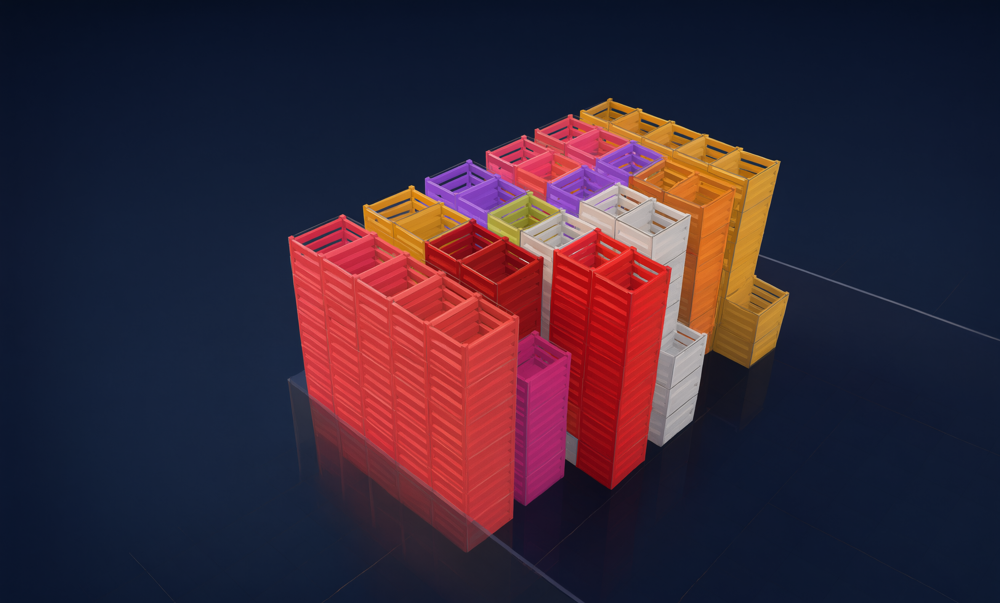

# WAREHOUSE

### Планирование склада в 3D

Здесь представлены не скриншоты, а **живая презентация**.
Вы листаете страницу, а 3D-сцена рассказывает историю продукта. В финале сцена ваша.

[ Открыть демо ](https://warehouse-preview.vercel.app/)

---

## Идея

Продукт обычно показывают картинками. Здесь вместо этого дают его **почувствовать**:
как это вести коробку по сетке, поставить её на паллету, поднять стопку целиком
и найти нужный груз среди сотен других в трёхмерном ангаре.

Всё, что происходит на странице, — настоящая логика полного продукта,
а не бутафория для ролика.

---

## История за один скролл

Одна длинная страница. Камера и объекты движутся вместе с прокруткой.

В конце — **песочница**: добавляйте объекты, таскайте, собирайте и разбирайте стопки,
вращайте, меняйте камеру и зум. Работает мышью, клавиатурой и тач-жестами.

---

## Демо и полная версия

Демо показывает часть продукта — одна сцена, один склад. Полная версия даёт то,
что нужно для реальной работы.

|  | Демо | Полная версия |
| :-- | :--: | :--: |
| Число объектов | до 20 | без лимита |
| Сохранение изменений | — | ✓ |
| Несколько складов и общая карта | — | ✓ |
| Перемещение между складами | — | ✓ |
| 2D-вид для работы со стопками | — | ✓ |
| Шаблоны объектов и стопок | — | ✓ |
| Поиск по всем складам | — | ✓ |
| Настройки сцены | — | ✓ |

Полное сравнение выведено прямо в финале страницы.

---

## Стек

**Презентации:** `React 19` + `TypeScript` · `Vite` · `Three.js / R3F` + `drei` · `Zustand` · `Lenis` · `lucide-react`

**Полного проекта:** `React 19` + `TypeScript` · `Vite` · `Three.js / R3F` + `drei` · `Zustand` · `react-hook-form + zod` · `CSS Modules` · `@dnd-kit` · `Vitest` · `Playwright` · `Vercel Functions + Neon Postgres`

---

**[warehouse-preview.vercel.app](https://warehouse-preview.vercel.app/)**

